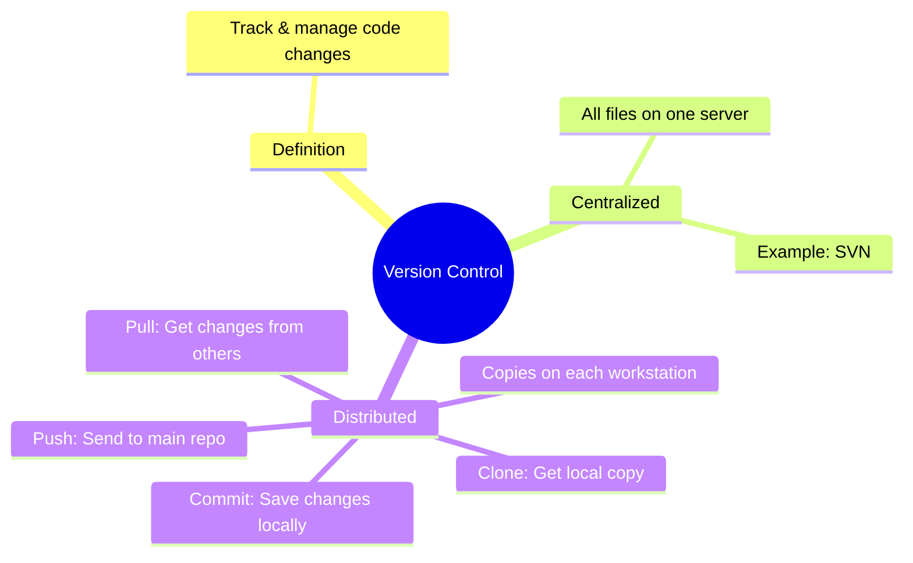

# Version Control Basics

## Key Terms:
- **Version Control** = track & manage code changes
- **Centralized** = one server with all files (SVN)
- **Distributed** = copies on each workstation (Git)
- **Clone** = make a local copy
- **Commit** = save changes locally
- **Push** = send to main repository
- **Pull** = get changes from others
